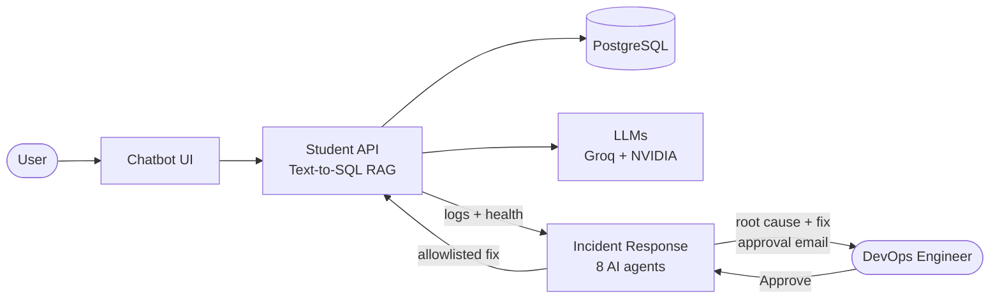
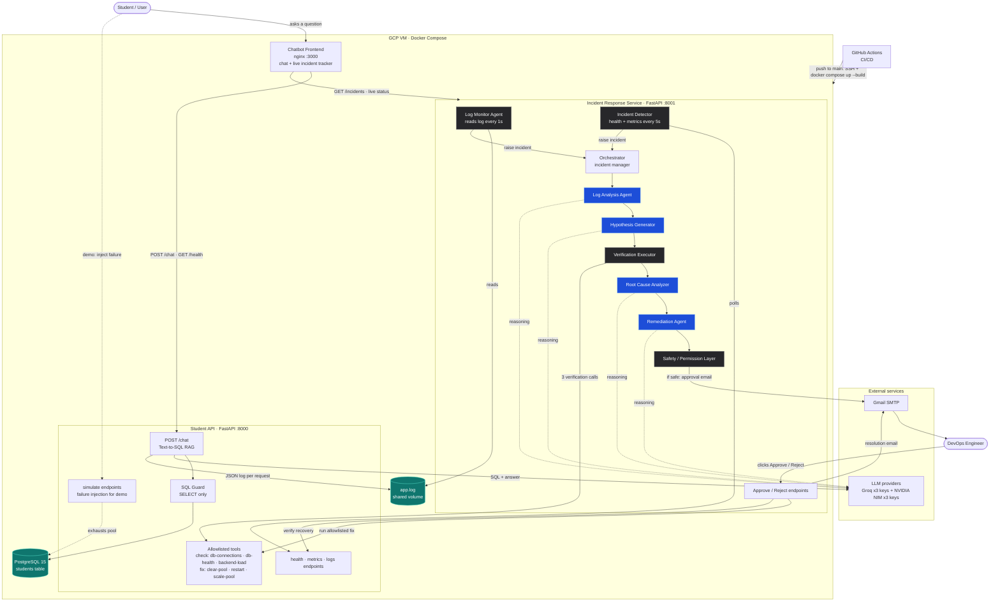

# Campus AI Assistant — Presentation Deck

Slide content for the HackQubit 2.0 (Problem 18) pitch: 9 slides, plus architecture diagrams in Mermaid.
Slide text is in English; speaker notes (🗣️) are in Hinglish to match the spoken pitch.

---

## Slide 1 — Title

**Campus AI Assistant: Multi-Agent AI Incident Response**
*AI investigates. Humans decide.*

- HackQubit 2.0 · Problem 18
- Team:
  - Shradha — Cloud & Deployment
  - Dumani — Frontend & Email UI
  - Saket — Backend & Text-to-SQL RAG
  - Om — Multi-Agent Incident Pipeline

🖼️ **Visual:** blue ring logo on the dark grid background (same as the chatbot).
🗣️ **Note:** "Hum aapko dikhayenge kaise AI production incidents ko minutes mein solve kar sakta hai, insaan ke control mein."

---

## Slide 2 — The Problem

**When production breaks, humans spend hours just finding out why**

- Failures happen at any hour: DB overload, timeouts, bad queries
- Manual triage: dig through logs, check metrics, guess, retry
- Long recovery time = lost users and lost trust
- Letting AI fix things on its own is risky: no control, no audit trail

🖼️ **Visual:** engineer at a laptop at 2 AM, with a red "500 Internal Server Error".
🗣️ **Note:** "Root cause dhoondhne mein hi ghante lag jaate hain, aur AI ko blindly fix karne dena safe nahi hai."

---

## Slide 3 — Our Solution

**An 8-agent AI system that detects, investigates and proposes the fix. A human approves it.**

- ⚡ **Detect fast:** reads API logs every second, health checks every 5s
- 🔍 **Investigate with evidence:** hypotheses verified with real backend tools
- 🛡️ **Fix safely:** allowlisted actions only, with human approval by email
- ✅ **Verify recovery:** automatic health check and confirmation email

🖼️ **Visual:** 4 icons in a row: Detect → Investigate → Approve → Recover.
🗣️ **Note:** "AI ki speed, insaan ka control. Yahi humara core idea hai."

---

## Slide 4 — The Demo App: Campus AI Assistant

**Ask about student data in plain English, with answers grounded in the database**

- Vectorless RAG (Text-to-SQL) on **PostgreSQL** (60 student records)
- Question → LLM writes SQL → **SQL guard (SELECT-only)** → database → short answer + results table
- SQL shown for transparency, so the model can't make up an answer
- Clean chat UI with a live system-status light

🖼️ **Visual:** screenshot of the chatbot answering "CGPA above 9" with the table and the SQL line.
🗣️ **Note:** "Har jawaab database se aata hai, aur SQL bhi dikhti hai. Koi hallucination nahi."

---

## Slide 5 — Architecture

**4 services on Google Cloud, deployed automatically**

- **Frontend** (nginx, port 3000): chatbot plus a live incident tracker
- **Student API** (FastAPI, port 8000): Text-to-SQL, logs, failure simulation, diagnostic and fix tools
- **PostgreSQL 15:** student database
- **Incident Response Service** (FastAPI, port 8001): log monitor, detector, 6 agents, email approval
- **LLMs:** Groq + NVIDIA NIM, with 6-key failover
- **Deployment:** Docker Compose on a GCP VM; every push to `main` auto-deploys via GitHub Actions

🖼️ **Visual:** the compact architecture diagram below (full diagram as a backup slide).
🗣️ **Note:** "Poora stack Docker mein hai aur har push par automatically deploy hota hai."

---

## Slide 6 — Meet the 8 Agents

**2 monitor continuously, 6 investigate each incident. 4 use the LLM, 4 are rule-based for safety.**

| Agent | Role | LLM |
|---|---|---|
| Log Monitor | Reads API logs every second, classifies errors | – |
| Incident Detector | Checks health and metrics every 5s | – |
| Log Analysis | Summarises logs and error signals | ✅ |
| Hypothesis Generator | Top 3 likely causes, plus a test for each | ✅ |
| Verification Executor | Runs 3 real diagnostic tools | – |
| Root Cause Analyzer | Confirms the cause with a confidence score | ✅ |
| Remediation | Proposes a fix with risk and blast radius | ✅ |
| Safety Layer | Allowlist and approval gate | – |

🗣️ **Note:** "Jahan sochna hai wahan LLM, jahan safety chahiye wahan fixed rules."

---

## Slide 7 — How an Incident Flows

**From failure to fix, end to end**

1. A request fails → the Log Monitor catches it within ~1s → classified as `DB_CONNECTION_EXHAUSTION`
2. Logs analysed → 3 hypotheses → 3 tool checks (DB connections, DB health, backend load)
3. Root cause confirmed → fix proposed → safety check passed
4. 📧 Email to DevOps with what happened, evidence, root cause, fix and risk, plus **Approve / Reject**
5. Approve → only the allowlisted tool runs → recovery verified → resolved + confirmation email
6. The user watches it all live in the chat, then clicks **"Ask again"**

🖼️ **Visual:** horizontal timeline with 6 steps, plus a small screenshot of the green "Service restored" card.
🗣️ **Note:** "User ko bhi chat mein live dikhta hai ki incident kis stage par hai."

---

## Slide 8 — Live Results

**From our live end-to-end test**

| Step | Time |
|---|---|
| Failure detected | **~1 second** |
| Root cause confirmed | **~11 seconds** (98% confidence) |
| Approval email sent | **~25 seconds** |
| Service restored after approval | **~30 seconds** |

- 3 of 3 verification tools succeeded
- One outage → one incident → one email (no alert spam)
- Hours of manual triage → **about a minute plus one click**

🖼️ **Visual:** screenshots of the approval email and the green "Service restored" tracker.
🗣️ **Note:** "Ye numbers humare real test ke hain. Ghanton ka kaam ek minute mein."

---

## Slide 9 — Safe by Design & What's Next

**Safety**
- No shell access for the AI; only predefined, allowlisted tools
- Human approval is required for every fix; reject = nothing runs
- Blast-radius check, plus an audit trail with a timeline for every incident

**Reliability**
- 6-key LLM failover (3 Groq + 3 NVIDIA) plus offline fallback
- Debounced detection; incidents close themselves if the service recovers on its own

**Next**
- ✅ Auto-scaling fix (DB pool 5 → 10), already built
- Persistent incident history, Slack/Teams alerts, more failure types

**Closing line:** *"Hours → minutes. AI investigates, humans decide."* · Thank you!

🗣️ **Note:** "AI ko power di hai, par control insaan ke haath mein hai. Dhanyavaad!"

---

## Screenshots to capture

1. A chat answer with its results table (slide 4)
2. The incident tracker card mid-incident (slide 7)
3. The approval email (slide 8)
4. The green "Service restored" card (slides 7 and 8)

---

## Architecture diagram — compact (for slide 5)

## Architecture diagram — full (backup / appendix slide)

Colour key: **blue** = agents that use the LLM, **dark grey** = rule-based agents, **teal** = data stores.

To use a diagram in PowerPoint: paste the code into <https://mermaid.live> and export it as PNG or SVG.
