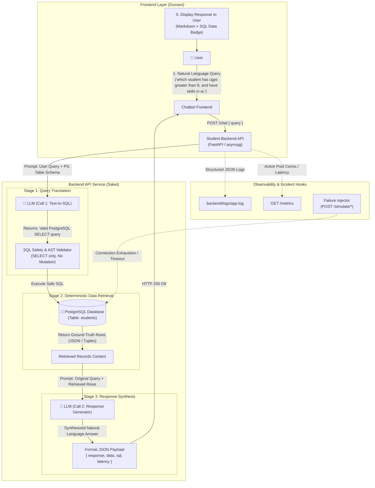

\# Multi-Agent Incident Response System

\## HackQubit 2.0 — Problem 18


\## 1. Project Goal


Build a multi-agent incident-response system for a chatbot application.


The chatbot allows users to query student data stored in an SQL database. When a backend failure occurs, the system automatically collects logs/metrics, analyzes the incident using an LLM, generates and verifies possible root-cause hypotheses, proposes a safe remediation, and sends an approval email to the DevOps engineer.


The DevOps engineer is the human-in-the-loop. The engineer approves or rejects the proposed resolution from the email. Only after approval can the system execute the predefined resolution tool and verify recovery.


\### Finalized End-to-End Flow


```text

INCIDENT DETECTED

&#x20;       ↓

COLLECT LOGS / METRICS

&#x20;       ↓

LLM LOG ANALYSIS

&#x20;       ↓

GENERATE 3 HYPOTHESES

&#x20;       ↓

3 VERIFICATION TOOL CALLS

&#x20;       ↓

CONFIRM ROOT CAUSE

&#x20;       ↓

GENERATE REMEDIATION PROPOSAL

&#x20;       ↓

SAFETY / PERMISSION CHECK

&#x20;       ↓

📧 SEND EMAIL TO DEVOPS ENGINEER

&#x20;       ↓

Engineer reviews:

\- What happened

\- Log summary

\- Root cause

\- Evidence from tools

\- Proposed solution

\- Risk / blast radius

&#x20;       ↓

&#x20;  \[ APPROVE ] / \[ REJECT ]

&#x20;       ↓

&#x20;     APPROVE

&#x20;       ↓

RESOLUTION TOOL

&#x20;       ↓

VERIFY RECOVERY

&#x20;       ↓

INCIDENT RESOLVED

```


\---


\# 2. Demo Application


Build a simple \*\*Student Data AI Chatbot\*\*.


Example user queries:


\- "Show students with CGPA above 8.5."

\- "Which students are eligible for placement?"

\- "Who has the highest CGPA?"

\- "Show CSE students."

\- "How many students have CGPA above 9?"


The chatbot sends the request to a backend API, which queries an SQL database.


\### Normal Architecture: Vectorless Structured RAG (PostgreSQL Text-to-SQL)

```text
User
 ↓
Chatbot Frontend (UI)
 ↓
Backend API (POST /chat)
 ↓
LLM Call 1: Text-to-SQL (PostgreSQL schema in system prompt)
 ↓
PostgreSQL Table (`students`) execution
 ↓
Retrieved Rows / Data Context
 ↓
LLM Call 2: Response Generation (Grounded synthesis)
 ↓
Chatbot Frontend (Response + SQL Transparency Badge)
 ↓
User
```


The application must be deliberately designed so that controlled failures can be injected during the demo.


Examples:


\- Database connection exhaustion

\- Database unavailable

\- SQL query timeout

\- Backend API timeout

\- Backend overload

\- Service unavailable

\- High CPU / resource exhaustion

\- Invalid SQL/query failure


DO NOT attack public websites or third-party systems. All load/failure testing must be performed against our own VM and our own demo services.


\---


\# 3. Team Responsibilities

\## Team Workflow & Collaboration Guidelines

> [!IMPORTANT]
> \### 🌿 Git Branching Strategy & Checklist Tracking
> 1. \*\*Separate Dedicated Branches for Each Member:\*\*
>    - Every team member must work on their own separate Git branch dedicated to their assigned domain. \*\*Never commit directly to `main`\*\*.
>    - Recommended branch naming:
>      - \*\*Shradha:\*\* `shradha/infra-setup` or `feat/infra-vm`
>      - \*\*Dumani:\*\* `dumani/frontend-ui` or `feat/chatbot-ui`
>      - \*\*Saket:\*\* `saket/backend-api` or `feat/student-api-db`
>      - \*\*Om:\*\* `om/incident-pipeline` or `feat/multi-agent-response`
> 2. \*\*Keep the Checklist Updated Continuously:\*\*
>    - All tasks are tracked in [CHECKLIST.md](CHECKLIST.md).
>    - Once any task or subtask is completed by a member, update its checkbox (`- [ ]` → `- [x]`) and increment the counter in the \*\*Team Progress Summary\*\* table in [CHECKLIST.md](CHECKLIST.md).
> 3. \*\*Adhere Strictly to Assigned Work:\*\*
>    - Each member must focus on their designated domain and assigned tasks.
>    - Do not modify files or logic owned by another teammate without prior agreement.
>    - Always honor the agreed integration interfaces documented in [Section 13](#13-team-integration-points).
> 4. \*\*Integration via Pull Requests:\*\*
>    - Submit a PR to `main` once your assigned milestone components are verified.
>    - Rebase / pull `main` regularly into your feature branch to prevent merge conflicts.

\---

\## Person 1 — Shradha

\### Cloud VM + Deployment + Environment


\### Primary responsibility


Set up the cloud environment where the complete project will run.


\### Tasks


1\. Purchase/create the Google Cloud VM.

2\. Configure:

&#x20;  - Linux environment

&#x20;  - SSH access

&#x20;  - Python

&#x20;  - Docker

&#x20;  - Docker Compose

&#x20;  - Git

&#x20;  - Required environment variables

3\. Create the deployment structure.

4\. Deploy the backend services and database.

5\. Ensure all team members can access the development environment/repository.

6\. Configure networking/firewall only for required application ports.

7\. Provide a stable URL/IP for the frontend/backend.

8\. Prepare controlled failure-injection mechanisms.

9\. Make sure logs and metrics can be accessed by the incident-response system.

10\. Maintain deployment documentation.


\### Expected output


```text

Google Cloud VM

&#x20;├── Docker

&#x20;├── Docker Compose

&#x20;├── Backend

&#x20;├── Database

&#x20;├── Monitoring / Logs

&#x20;├── AI Incident System

&#x20;└── Frontend

```


\### Important


Do not expose unrestricted shell access to the AI agent.


Remediation must happen through predefined, allowlisted tools/endpoints.


\---


\# 4. Person 2 — Dumani

\## Frontend UI / UX


\### Primary responsibility


Create the user-facing chatbot interface and the DevOps approval email interface/design.


\### A. Chatbot UI


Build a clean, professional chatbot UI.


It should contain:


\- Chat window

\- User messages

\- AI responses

\- Loading state

\- Error state

\- Clear incident/error message

\- Optional system status indicator


Example:


```text

┌──────────────────────────────────────────┐

│          Campus AI Assistant             │

├──────────────────────────────────────────┤

│                                          │

│ User: Show students with CGPA > 8.5     │

│                                          │

│ AI: Here are the matching students...    │

│                                          │

│ \[ Type your question... ]       \[Send]   │

└──────────────────────────────────────────┘

```


\### B. Incident UI


If useful, include a small incident status area:


```text

System Status: 🟢 Healthy


or


System Status: 🔴 Incident Detected

```


\### C. DevOps Email UI


Design the HTML email that the engineer receives.


The email should clearly show:


```text

🚨 INCIDENT RESPONSE REQUIRED


Service:

Student Query API


Severity:

HIGH


What happened:

...


Log Summary:

...


Root Cause:

Database connection exhaustion


Confidence:

94%


Evidence:

✓ check\_db\_connections()

✓ check\_db\_cpu()

✓ check\_backend\_load()


Proposed Resolution:

Restart Student Query API


Risk:

LOW


Blast Radius:

Student Query API only


\[ APPROVE RESOLUTION ]


\[ REJECT ]

```


The Approve button must call the backend approval endpoint.


The Reject button must also call a backend endpoint and mark the incident as rejected.


\### Expected output


\- Responsive chatbot UI

\- Professional visual design

\- HTML email template

\- Approve/Reject buttons integrated with backend APIs


\---


\# 5. Person 3 — Saket

\## Chatbot Architecture + Backend: Vectorless Structured RAG (Text-to-SQL)

\### Primary responsibility

Build the student data chatbot application and its backend architecture using a **Vectorless RAG (Text-to-SQL) pipeline over PostgreSQL (`pg`)**.

---

\### A. Architectural Concept: RAG Without Vector DB (Structured Data RAG)

Traditional RAG relies on vector databases (embeddings + cosine similarity) to retrieve unstructured text chunks. However, for structured student databases:
- **Numerical comparisons** (e.g., `cgpa > 8.0`), exact aggregations (`COUNT`, `AVG`, `MAX`), and boolean constraints cannot be reliably solved by cosine similarity in vector spaces.
- **PostgreSQL (`pg`) Table** acts as the single deterministic source of truth for structured tabular records.
- **LLM-driven Text-to-SQL** replaces vector embedding retrieval:
  1. The LLM converts natural language into a deterministic SQL query using the PostgreSQL table schema provided in the system prompt.
  2. The SQL query runs directly against the PostgreSQL database to retrieve the ground-truth rows.
  3. A second LLM pass synthesizes those retrieved records into a user-friendly natural language response.



---

\### B. End-to-End 5-Step Pipeline Walkthrough

The chatbot processes every question through 5 distinct phases:

#### 1. User Query Intake
The user types a natural language query into the frontend:
> **User Query:** *"which student has cgps greater than 8, and have skills in ai."*

Frontend makes an HTTP request:
```http
POST /chat HTTP/1.1
Content-Type: application/json

{
  "query": "which student has cgps greater than 8, and have skills in ai."
}
```

#### 2. LLM Call 1 — Text-to-SQL Translation (Schema in System Prompt)
The backend calls the LLM with a system prompt that includes the exact PostgreSQL schema and rules.

**System Prompt (Text-to-SQL):**
```text
You are an expert PostgreSQL database engineer for a university student system.
Your sole job is to translate the user's natural language question into a single, valid, safe PostgreSQL SELECT query.

Database Schema:
Table: students
Columns:
  - student_id: VARCHAR(20) (Primary Key, e.g., 'STU001')
  - name: VARCHAR(100) (Student full name)
  - department: VARCHAR(50) (e.g., 'Computer Science', 'Information Technology', 'Electronics & Comm')
  - year: INTEGER (Current academic year: 1, 2, 3, 4)
  - cgpa: REAL / NUMERIC (Cumulative GPA, range 0.00 to 10.00)
  - email: VARCHAR(120) (Student email address)
  - skills: TEXT (Comma-separated skills, e.g., 'Python, PyTorch, AI, Docker')
  - placement_status: VARCHAR(20) ('Placed', 'Eligible', 'Not Eligible')

Rules:
1. Generate ONLY standard PostgreSQL read-only SELECT statements.
2. NEVER generate INSERT, UPDATE, DELETE, DROP, ALTER, TRUNCATE, or GRANT statements.
3. For text searches in skills or departments, use case-insensitive matching: `ILIKE '%ai%'`.
4. Output ONLY the raw SQL query with no markdown backticks, no commentary, and no explanation.
```

**LLM Call 1 Output (Generated SQL):**
```sql
SELECT student_id, name, department, year, cgpa, email, skills, placement_status
FROM students
WHERE cgpa > 8.0 AND (skills ILIKE '%ai%' OR skills ILIKE '%artificial intelligence%')
ORDER BY cgpa DESC;
```

#### 3. SQL Query Execution on PostgreSQL (`pg`) Table
- **Safety Validation:** The backend validates that the query begins with `SELECT` and contains no forbidden tokens or semicolon chaining.
- **Execution:** The backend checks out a connection from the PostgreSQL connection pool (`asyncpg` / `psycopg2`) and executes the query.
- **Result Rows:**
```json
[
  {
    "student_id": "STU001",
    "name": "Aarav Sharma",
    "department": "Computer Science",
    "year": 4,
    "cgpa": 9.42,
    "email": "aarav.sharma@campus.edu",
    "skills": "Python, PyTorch, AI, PostgreSQL",
    "placement_status": "Placed"
  },
  {
    "student_id": "STU008",
    "name": "Meera Rao",
    "department": "Computer Science",
    "year": 4,
    "cgpa": 9.78,
    "email": "meera.rao@campus.edu",
    "skills": "Machine Learning, AI, Rust, C++",
    "placement_status": "Placed"
  },
  {
    "student_id": "STU006",
    "name": "Sneha Nair",
    "department": "Information Technology",
    "year": 4,
    "cgpa": 8.35,
    "email": "sneha.nair@campus.edu",
    "skills": "Angular, Python, AI, Django, AWS",
    "placement_status": "Placed"
  }
]
```

*(Note: If the pool is exhausted by a failure injection scenario, this step throws an error and triggers the incident logging pipeline!)*

#### 4. LLM Call 2 — Response Generation (Grounded Synthesis)
The backend supplies both the original question and the retrieved database records to the LLM to compose a fluent, grounded answer.

**System Prompt (Synthesizer):**
```text
You are a helpful student academic advisor assistant.
Answer the user's question accurately and concisely using ONLY the provided database query results.
Do not invent or assume information not present in the records.
If no records matched, inform the user clearly.
Highlight the students' names, CGPAs, departments, and matching skills.
```

**User Prompt:**
```text
User Question: "which student has cgps greater than 8, and have skills in ai."

Retrieved Database Records:
[{"student_id": "STU008", "name": "Meera Rao", "department": "Computer Science", "year": 4, "cgpa": 9.78, "skills": "Machine Learning, AI, Rust, C++", "placement_status": "Placed"}, {"student_id": "STU001", "name": "Aarav Sharma", "department": "Computer Science", "year": 4, "cgpa": 9.42, "skills": "Python, PyTorch, AI, PostgreSQL", "placement_status": "Placed"}, {"student_id": "STU006", "name": "Sneha Nair", "department": "Information Technology", "year": 4, "cgpa": 8.35, "skills": "Angular, Python, AI, Django, AWS", "placement_status": "Placed"}]
```

**LLM Call 2 Output:**
> "Here are the students with a CGPA greater than 8.0 and skills in AI:
> 
> 1. **Meera Rao** (Computer Science, Year 4) — **CGPA: 9.78** | Skills: *Machine Learning, AI, Rust, C++* (Status: Placed)
> 2. **Aarav Sharma** (Computer Science, Year 4) — **CGPA: 9.42** | Skills: *Python, PyTorch, AI, PostgreSQL* (Status: Placed)
> 3. **Sneha Nair** (Information Technology, Year 4) — **CGPA: 8.35** | Skills: *Angular, Python, AI, Django, AWS* (Status: Placed)"

#### 5. User is Shown the Response
Backend returns the response along with transparency metadata so the frontend can display both the conversational answer and an optional view of the underlying SQL query:
```json
{
  "query": "which student has cgps greater than 8, and have skills in ai.",
  "response": "Here are the students with a CGPA greater than 8.0 and skills in AI: ...",
  "data": [
    { "student_id": "STU008", "name": "Meera Rao", "department": "Computer Science", "cgpa": 9.78, "skills": "Machine Learning, AI, Rust, C++" },
    { "student_id": "STU001", "name": "Aarav Sharma", "department": "Computer Science", "cgpa": 9.42, "skills": "Python, PyTorch, AI, PostgreSQL" },
    { "student_id": "STU006", "name": "Sneha Nair", "department": "Information Technology", "cgpa": 8.35, "skills": "Angular, Python, AI, Django, AWS" }
  ],
  "metadata": {
    "generated_sql": "SELECT student_id, name, department, year, cgpa, email, skills, placement_status FROM students WHERE cgpa > 8.0 AND (skills ILIKE '%ai%' OR skills ILIKE '%artificial intelligence%') ORDER BY cgpa DESC;",
    "row_count": 3,
    "execution_time_ms": 142
  }
}
```

---

\### C. PostgreSQL (`pg`) Database Schema & Seed Data

#### Table Definition (`database/schema.sql`)
```sql
CREATE TABLE IF NOT EXISTS students (
    student_id VARCHAR(20) PRIMARY KEY,
    name VARCHAR(100) NOT NULL,
    department VARCHAR(50) NOT NULL,
    year INTEGER NOT NULL,
    cgpa REAL NOT NULL,
    email VARCHAR(120) NOT NULL UNIQUE,
    skills TEXT NOT NULL,
    placement_status VARCHAR(20) NOT NULL
);

-- Performance & search index
CREATE INDEX IF NOT EXISTS idx_students_cgpa ON students(cgpa);
CREATE INDEX IF NOT EXISTS idx_students_dept ON students(department);
CREATE INDEX IF NOT EXISTS idx_students_placement ON students(placement_status);
```

#### Seed Data (`database/seed.sql`)
Populate with 50–100 realistic records covering:
- Departments: `CSE`, `AI & DS`, `IT`, `ECE`, `MECH`, `CIVIL`.
- CGPA ranges: `6.00` to `9.85`.
- Diverse skill sets: `Python, AI, Machine Learning, Deep Learning, Cloud, DevOps, SQL, Java, React, C++`.

---

\### D. Backend API Specifications

Saket implements the following endpoints in FastAPI / Express:

```text
POST /chat                               # User natural language query -> Text-to-SQL RAG -> Response
GET  /health                             # Liveness & PostgreSQL connection health
GET  /students                           # Direct inspection of student rows (with limit/offset)
GET  /metrics                            # Latency, pool utilization, active connections, error count
GET  /logs                               # Tail / filter structured application logs
```

#### Request/Response Contract for `POST /chat`
- **Request Body:**
  ```json
  {
    "query": "which student has cgps greater than 8, and have skills in ai."
  }
  ```
- **Success Response (200 OK):**
  ```json
  {
    "status": "success",
    "query": "which student has cgps greater than 8, and have skills in ai.",
    "response": "Here are the students with a CGPA greater than 8.0 and skills in AI: ...",
    "data": [...],
    "metadata": {
      "generated_sql": "SELECT ... FROM students WHERE cgpa > 8.0 ...",
      "row_count": 3,
      "latency_ms": 280
    }
  }
  ```
- **Failure Response (500 Internal Server Error) during simulated incident:**
  ```json
  {
    "status": "error",
    "error_code": "DB_CONNECTION_TIMEOUT",
    "message": "Failed to execute database query: connection pool exhausted (timeout waiting for pool slot after 3000ms)",
    "request_id": "req-98213f"
  }
  ```

---

\### E. Structured Logging

Every request generates a structured JSON log entry in `backend/logs/app.log`:

```json
{
  "timestamp": "2026-10-07T14:15:30.124Z",
  "service": "student-api",
  "request_id": "req-98213f",
  "endpoint": "/chat",
  "user_query": "which student has cgps greater than 8, and have skills in ai.",
  "generated_sql": "SELECT * FROM students WHERE cgpa > 8.0 AND skills ILIKE '%ai%'",
  "db_pool_active": 10,
  "db_pool_max": 10,
  "status": 500,
  "error": "asyncpg.exceptions.PoolTimeoutError: Timeout waiting for connection from pool after 3.0s",
  "latency_ms": 3005
}
```

These logs provide immediate root-cause evidence for Om's Log Analysis and Hypothesis Agents.

---

\### F. Failure Simulation Endpoints (`/simulate/*`)

Endpoints exclusively for controlled demonstration of backend incidents:

```text
POST /simulate/connection-exhaustion     # Exhausts PostgreSQL pool by leasing all connections and blocking
POST /simulate/db-timeout                # Introduces pg_sleep() or synthetic delay > query timeout
POST /simulate/db-unavailable            # Points pool to dead port or stops PostgreSQL service
POST /simulate/api-delay                 # Injects 5-10s latency before LLM/DB processing
POST /simulate/invalid-sql               # Simulates LLM returning syntax error / malformed SQL
```

---

\### G. Verification & Resolution Tool Endpoints (For Om's Incident Agents)

Saket exposes internal diagnostic and remediation endpoints called by Om's agents:

#### Verification Tools (Read-Only)
- `GET /tools/check-db-connections`:
  ```json
  { "active_connections": 10, "max_pool_size": 10, "waiting_requests": 8, "pool_exhausted": true }
  ```
- `GET /tools/check-db-health`:
  ```json
  { "db_reachable": true, "ping_latency_ms": 4.2, "can_query": false, "error": "PoolTimeout" }
  ```
- `GET /tools/check-backend-load`:
  ```json
  { "cpu_percent": 18.5, "memory_mb": 142.0, "active_http_requests": 12 }
  ```

#### Resolution Tools (Allowlisted Remediation)
- `POST /tools/clear-connection-pool`: Drops all held connections, recycles the PostgreSQL connection pool, and restores availability.
- `POST /tools/restart-student-api`: Gracefully restarts the student backend service process.

---

\### Expected output

- Working Vectorless RAG chatbot backend (PostgreSQL + FastAPI/Node)
- Schema-informed Text-to-SQL prompt and response synthesis pipeline
- Seeded PostgreSQL `students` table
- Structured JSON logging capturing query, SQL, and error states
- Controlled failure simulation suite (`/simulate/*`)
- Allowlisted verification and recovery endpoints for Om's multi-agent system
- Clean OpenAPI / Swagger documentation (`/docs`)


\---


\# 6. Person 4 — Om

\## Downstream Incident-Response System


\### Primary responsibility


Build the complete AI incident-response pipeline after an incident is detected.


This is the core AI-agent portion.


\---


\## A. Define Error Catalogue


Create a structured list of possible errors.


Example:


```text

1\. Database Connection Exhaustion

2\. Database Unavailable

3\. Database Query Timeout

4\. Backend API Timeout

5\. Backend Overload

6\. High CPU Usage

7\. High Memory Usage

8\. Invalid SQL Query

9\. Service Unavailable

10\. Dependency Failure

```


For every error define:


```text

Error Name

Symptoms

Relevant Logs

Verification Tool

Expected Tool Result

Possible Remediation

Risk

Blast Radius

```


\---


\# 7. Agent Design


Use specialized agents/components.


\### Agent 1 — Log Analysis Agent


Input:


\- Incident information

\- Backend logs

\- Metrics


Output:


\- Short log summary

\- Important error signals

\- Context for hypothesis generation


\---


\### Agent 2 — Hypothesis Generator


Generate exactly the top 3 probable root causes.


Example:


```text

Hypothesis 1:

Database connection exhaustion — 75%


Hypothesis 2:

Database server overload — 15%


Hypothesis 3:

Backend API overload — 10%

```


The probabilities/confidence values must be treated as model estimates, not guaranteed truth.


\---


\### Agent 3 — Verification Tools


Each hypothesis must have a corresponding backend tool.


Example:


```text

check\_db\_connections()

check\_db\_health()

check\_backend\_load()

```


The LLM should decide which tools to call based on the hypotheses.


Tool results must be returned to the reasoning layer.


\---


\### Agent 4 — Root Cause Analyzer


Combine:


\- Original logs

\- Metrics

\- Hypotheses

\- Tool results


Then determine the confirmed/most-supported root cause.


Example:


```text

Root Cause:

Database connection pool exhausted


Evidence:

100/100 DB connections active

DB CPU normal

Backend request rate normal


Confidence:

High

```


\---


\### Agent 5 — Remediation Agent


Generate a safe remediation proposal.


Example:


```text

Proposed action:

Restart Student Query API


Reason:

Stale/exhausted database connections are causing request failures.


Risk:

Low


Blast Radius:

Student Query API only

```


\---


\### Agent 6 — Safety / Permission Layer


This is a mandatory control layer.


The AI must NOT have arbitrary system access.


Create an allowlist such as:


```text

Allowed:

✓ restart\_student\_api

✓ clear\_connection\_pool

✓ scale\_student\_api

✓ check\_db\_connections

✓ check\_service\_health


Not allowed:

✗ delete\_database

✗ modify\_student\_records

✗ restart\_entire\_vm

✗ execute\_arbitrary\_shell

```


The safety layer verifies:


```text

Is this action allowed?

Is the target service allowed?

Is the blast radius acceptable?

Does this action require human approval?

```


Only safe, predefined actions can reach the approval email.


\---


\# 8. Email Approval Flow


After root cause confirmation and safety checking:


```text

Root Cause Confirmed

&#x20;       ↓

Remediation Proposal

&#x20;       ↓

Safety Check

&#x20;       ↓

Send Email

```


The engineer receives the complete incident report.


The email contains:


\- Incident ID

\- Severity

\- Service

\- What happened

\- Log summary

\- Top 3 hypotheses

\- Verification results

\- Confirmed root cause

\- Confidence

\- Proposed remediation

\- Risk

\- Blast radius

\- Timestamp


Then:


```text

\[ APPROVE RESOLUTION ]

\[ REJECT RESOLUTION ]

```


\---


\# 9. Approval APIs


Create backend endpoints such as:


```text

POST /incidents/{incident\_id}/approve

POST /incidents/{incident\_id}/reject

```


\### On APPROVE


```text

Email

&#x20;↓

POST /incidents/{id}/approve

&#x20;↓

Validate incident

&#x20;↓

Validate remediation

&#x20;↓

Execute allowlisted resolution tool

&#x20;↓

Verify recovery

&#x20;↓

Update incident status

```


\### On REJECT


```text

Email

&#x20;↓

POST /incidents/{id}/reject

&#x20;↓

Mark incident as rejected

&#x20;↓

Record engineer decision

&#x20;↓

Do NOT execute remediation

```


\---


\# 10. Resolution Tools


Create predefined tools/endpoints.


Example:


```text

restart\_student\_api()

clear\_connection\_pool()

scale\_student\_api()

```


Do NOT allow the LLM to generate arbitrary shell commands.


\---


\# 11. Recovery Verification


After the approved remediation:


```text

Resolution Tool

&#x20;     ↓

Wait for service recovery

&#x20;     ↓

Check /health

&#x20;     ↓

Check error rate

&#x20;     ↓

Check latency

&#x20;     ↓

Check database connectivity

```


Example:


```text

Before:

Error Rate: 63%

Latency: 4.8 sec


After:

Error Rate: 1.4%

Latency: 210 ms


Status:

✅ INCIDENT RESOLVED

```


If recovery fails:


```text

Recovery Failed

&#x20;     ↓

Incident remains open

&#x20;     ↓

Create new analysis / escalation

```


\---


\# 12. Overall System Architecture


```mermaid

flowchart TD


&#x20;   USER\[User] --> FRONTEND\[Student AI Chatbot]


&#x20;   FRONTEND --> API\[Student Backend API]


&#x20;   API --> LLM\[Chatbot LLM]

&#x20;   API --> DB\[(SQL Student Database)]


&#x20;   API --> LOGS\[Application Logs]

&#x20;   API --> METRICS\[Application Metrics]


&#x20;   LOGS --> DETECTOR\[Incident Detector]

&#x20;   METRICS --> DETECTOR


&#x20;   DETECTOR --> INCIDENT\[Incident Created]


&#x20;   INCIDENT --> ANALYZER\[LLM Log Analysis Agent]


&#x20;   ANALYZER --> HYP\[Generate Top 3 Hypotheses]


&#x20;   HYP --> H1\[Hypothesis 1]

&#x20;   HYP --> H2\[Hypothesis 2]

&#x20;   HYP --> H3\[Hypothesis 3]


&#x20;   H1 --> T1\[Verification Tool 1]

&#x20;   H2 --> T2\[Verification Tool 2]

&#x20;   H3 --> T3\[Verification Tool 3]


&#x20;   T1 --> RCA\[Root Cause Analyzer]

&#x20;   T2 --> RCA

&#x20;   T3 --> RCA


&#x20;   RCA --> ROOT\[Confirmed Root Cause]


&#x20;   ROOT --> REM\[Remediation Agent]


&#x20;   REM --> SAFETY\[Safety / Permission Layer]


&#x20;   SAFETY --> EMAIL\[Send Approval Email]


&#x20;   EMAIL --> DEVOPS\[DevOps Engineer]


&#x20;   DEVOPS -->|Approve| APPROVE\[Approval API]

&#x20;   DEVOPS -->|Reject| REJECT\[Rejection API]


&#x20;   APPROVE --> RESOLVE\[Resolution Tool]


&#x20;   RESOLVE --> VERIFY\[Recovery Verification]


&#x20;   VERIFY -->|Recovered| RESOLVED\[Incident Resolved]


&#x20;   VERIFY -->|Failed| OPEN\[Incident Still Open]


&#x20;   REJECT --> REJECTED\[Remediation Rejected]


&#x20;   INCIDENT --> TIMELINE\[Incident Timeline]

&#x20;   ANALYZER --> TIMELINE

&#x20;   HYP --> TIMELINE

&#x20;   RCA --> TIMELINE

&#x20;   EMAIL --> TIMELINE

&#x20;   APPROVE --> TIMELINE

&#x20;   RESOLVE --> TIMELINE

&#x20;   VERIFY --> TIMELINE

```


\---


\# 13. Team Integration Points


Everyone must agree on these interfaces early. Work on separate feature branches and keep [CHECKLIST.md](CHECKLIST.md) updated as each integration milestone is verified.


\### Saket → Om


Saket provides:


```text

GET /logs

GET /metrics

GET /health

```


and the controlled verification/remediation APIs.


\### Om → Saket


Om specifies exactly which tools are required.


Example:


```text

check\_db\_connections

check\_db\_health

check\_backend\_load

restart\_student\_api

clear\_connection\_pool

```


Saket implements the backend endpoints/tools.


\### Saket → Dumani


Provide:


```text

POST /chat

GET /health

```


Dumani connects the frontend to these APIs.


\### Dumani → Om


Dumani provides the final HTML email template and button/API requirements.


\### Shradha → Everyone


Shradha provides:


\- VM IP/domain

\- deployment instructions

\- environment variables

\- Docker environment

\- running service URLs

\- database access configuration

\- log/metric access


\---


\# 14. Recommended Repository Structure


```text

project/

│

├── frontend/

│   └── chatbot-ui/

│

├── backend/

│   ├── app/

│   ├── routes/

│   ├── database/

│   ├── services/

│   └── logs/

│

├── incident-response/

│   ├── agents/

│   │   ├── log\_analyzer.py

│   │   ├── hypothesis\_generator.py

│   │   ├── rca\_agent.py

│   │   ├── remediation\_agent.py

│   │   └── safety\_agent.py

│   │

│   ├── tools/

│   │   ├── verification\_tools.py

│   │   └── remediation\_tools.py

│   │

│   ├── incident\_manager.py

│   └── timeline.py

│

├── database/

│   └── seed.sql

│

├── email/

│   └── incident\_template.html

│

├── docker-compose.yml

│

├── docs/

│   └── architecture.md

│

└── README.md

```


\---


\# 15. 24-Hour MVP Priority


Do NOT try to build everything perfectly.


\### Must work


1\. Chatbot

2\. SQL database

3\. One real failure scenario

4\. Logs captured

5\. LLM log analysis

6\. Three hypotheses

7\. Three verification tools

8\. Root cause confirmation

9\. Remediation proposal

10\. Safety check

11\. Email with Approve/Reject

12\. Resolution tool

13\. Recovery verification


\### Nice to have


\- Multiple failure scenarios

\- Grafana dashboard

\- Multiple remediation options

\- Incident replay UI

\- Multiple DevOps users

\- Advanced agent memory

\- Fancy animations


\---


\# 16. Primary Demo Scenario


Use one highly reliable scenario for the final presentation.


\### Scenario: Database Connection Exhaustion


```text

User asks:

"Show students with CGPA above 8.5."


&#x20;       ↓


Backend tries SQL query.


&#x20;       ↓


Database connection pool is exhausted.


&#x20;       ↓


Request fails.


&#x20;       ↓


Incident detected.


&#x20;       ↓


Logs analyzed.


&#x20;       ↓


Top 3 hypotheses generated.


&#x20;       ↓


3 verification tools called.


&#x20;       ↓


Database connection exhaustion confirmed.


&#x20;       ↓


Restart Student API proposed.


&#x20;       ↓


Safety check passes.


&#x20;       ↓


DevOps engineer receives email.


&#x20;       ↓


Engineer clicks APPROVE.


&#x20;       ↓


Resolution tool restarts Student API.


&#x20;       ↓


Recovery verified.


&#x20;       ↓


Error rate falls.


&#x20;       ↓


INCIDENT RESOLVED.

```


This single scenario should be completely polished before adding additional failure scenarios.


\---


\# 17. Important Safety Rule


The system must operate only on our own hackathon VM and simulated application.


Never send load, failure injection, or attack traffic to public websites or third-party infrastructure.


The goal is to demonstrate \*\*controlled incident response\*\*, not a real DDoS attack.

